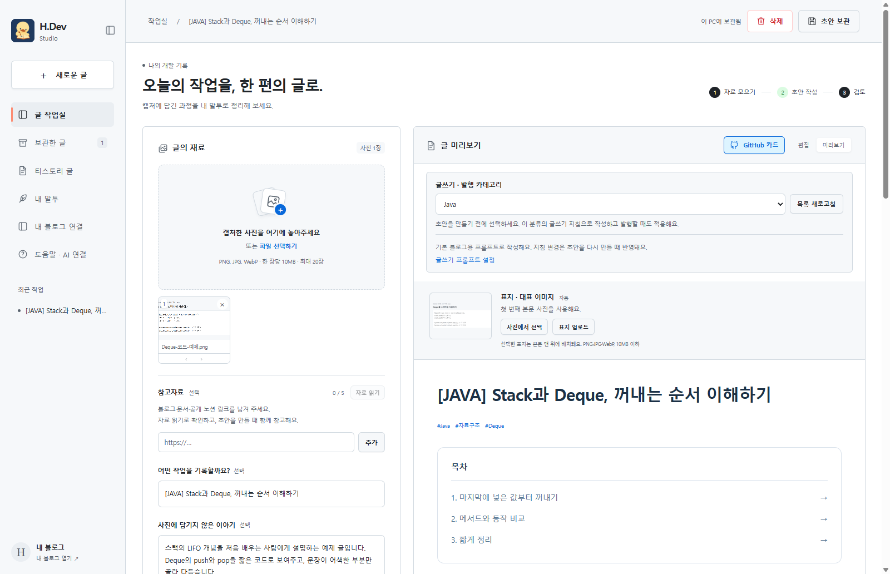

# H.Dev Studio

<p align="center">
  
</p>

<p align="center">
  <strong>캡처에 담긴 개발 과정을, 내 말투의 블로그 글로.</strong>
</p>

<p align="center">
  Windows x64 · Codex / Claude Code CLI · Tistory
</p>

개발 캡처와 메모로 초안을 만들고, 편집·미리보기 후 직접 검토한 글을 티스토리에 발행하는 Windows 앱입니다.

> 대표 이미지는 제품 콘셉트 일러스트입니다. 아래는 실제 앱 화면입니다.

## 실제 화면

<p align="center">
  
</p>

## Windows 앱 다운로드

[H.Dev Studio 0.6.0 다운로드](https://github.com/Hlxecz/blog-automation/releases/tag/v0.6.0)에서 `HDev-Studio-0.6.0-win-x64.exe`를 받아 실행하세요. 설치가 필요 없는 Windows 64비트 앱입니다.

처음 실행하면 **작업실 → 자료 폴더 열기**에서 `tistory.config.json`의 `blogUrl`을 본인 블로그 주소로 바꾸고 앱을 다시 실행합니다. **도움말 · AI 연결**에서 Codex 또는 Claude Code를 선택하고 본인 계정으로 로그인하세요. [자세한 사용 안내](docs/USAGE.md)를 참고하세요.

## 주요 기능

- 사진 업로드, 순서 변경, 작업 메모
- Codex / Claude Code CLI 선택, 설치·로그인 도움말, 이미지 분석과 초안 생성
- 제목·본문·태그 편집과 미리보기
- 편집 항목 드래그 이동과 항목 사이에 문단·사진·코드·표 추가
- 참고자료 링크 최대 5개, 공개 노션 본문 읽기와 직접 붙여 넣기
- 자동 목차, 팁·주의 상자, 목차 아래 GitHub 정보 카드
- 기존 사진에서 표지 선택 또는 별도 표지 업로드
- 티스토리 상위·하위 카테고리 불러오기, 글별 선택 보관과 해당 분류로 발행
- 로컬 초안 보관, 용량 확인, 글 단위 삭제
- 여러 티스토리 블로그의 공개 글 목록과 로그인된 글 관리 화면
- 검토 후 **티스토리에 발행** 버튼으로 사진 업로드부터 공개 게시까지 실행

현재 버전은 [package.json](package.json)에서 관리합니다. [버전별 변경 내역](CHANGELOG.md)과 [자세한 사용법](docs/USAGE.md)을 참고하세요.

저장소: [Hlxecz/blog-automation](https://github.com/Hlxecz/blog-automation) · [버전 태그](https://github.com/Hlxecz/blog-automation/tags). `v0.3.0`부터 `v0.3.4`까지는 남아 있던 배포본의 소스를 복원한 기록입니다. 복원 범위는 [소스 이력 안내](docs/HISTORY.md)에 정리했습니다.

## 개발 실행

Windows 64비트, Node.js 22 이상이 필요합니다.

```powershell
npm ci
npm run setup
```

생성된 `tistory.config.json`의 `blogUrl`에 내 블로그 주소를 입력하고, `style/profile.md`에 말투 지침을 준비합니다. 기본 템플릿은 특정 사용자의 글을 분석한 프로필이 아닙니다. `setup`을 다시 실행해도 기존 설정은 보존합니다.

각 사용자는 자신의 티스토리 계정과 선택한 AI의 CLI 계정으로 로그인합니다. 글 목록에 다른 블로그를 추가하는 것만으로 발행 대상이 바뀌지는 않습니다. 발행 대상은 `blogUrl`입니다.

```powershell
npm start          # 웹 개발 화면
npm run desktop    # Electron 앱: 티스토리 발행 지원
```

앱의 **도움말 · AI 연결**에서 **Codex** 또는 **Claude Code**를 선택하세요. 설치·로그인 명령을 복사하고 연결을 확인할 수 있습니다. 선택은 이 PC에 저장되며 초안 생성과 말투 분석에 함께 적용됩니다. 각 CLI에 본인 계정으로 로그인하며, 앱에 API 키를 입력할 필요는 없습니다. 사진·메모·말투 지침과 분석할 공개 본문은 선택한 제공사에 전송되고 해당 계정의 요금·사용량 정책이 적용됩니다. [AI 연결 방법](docs/USAGE.md#ai-연결-방법)을 참고하세요.

## 검사와 배포용 EXE

```powershell
npm run release:check
npm test
npm run test:desktop
npm run build:exe
```

배포용 파일은 `dist/<버전>/`에 생성합니다. 같은 버전의 EXE가 있으면 덮어쓰지 않습니다. 개발 중 확인은 `npm run desktop`을 사용하고, EXE는 배포할 때 만듭니다.

**로컬 EXE는 최신 버전 하나만 보관합니다.** 버전별 소스는 Git 커밋과 태그로 관리하며, 필요할 때 해당 버전을 내려받아 다시 빌드합니다. 사용자 사진·초안은 빌드 정리 대상에 포함하지 않습니다.

버전 올리기, 배포 파일 확인, GitHub 등록 절차는 [버전·배포 관리](docs/RELEASING.md)에 정리했습니다.

## 문서와 구조

| 위치 | 내용 |
| --- | --- |
| [사용 안내](docs/USAGE.md) | 설치, AI, 표지, 보관·삭제, 발행 상태와 검증 한계 |
| [변경 내역](CHANGELOG.md) | 버전별 기능·수정 이력 |
| [트러블슈팅 기록](docs/TROUBLESHOOTING.md) | 제작 과정의 문제·원인·해결·검증 범위 |
| [버전·배포 관리](docs/RELEASING.md) | 버전 규칙, EXE, GitHub 업로드 절차 |
| [글쓰기 규칙](docs/WRITING.md) | 캡처 분석, 말투 참고, 초안 형식 |
| [작업 지침](AGENTS.md) | 에이전트의 작업 범위와 자료 보호 |
| `desktop/` | Electron 앱과 티스토리 편집기 연결 |
| `web/` | 사진·초안 편집과 미리보기 화면 |
| `scripts/` | 로컬 API, AI 생성, 보관, 발행, 초기 설정·빌드 |
| `config/` | 저장소에 공유하는 기본 설정 템플릿 |
| `test/`, `validation/` | 자동 검사와 외부 발행 없는 편집기 검증 |
| `.github/workflows/` | Windows 검사와 수동 EXE 빌드 |

## 자료와 저장소

사진·초안·말투 원문·개인 설정·로그·로그인 자료·EXE는 `.gitignore`로 제외합니다. 공유할 설정은 `config/`의 예제를 수정하세요. EXE를 GitHub에 배포할 때는 저장소 코드에 넣지 않고 Releases에 첨부합니다.

개인 사용 중인 EXE에는 빌드 당시의 블로그 주소와 말투 기본값이 들어 있을 수 있습니다. 다른 사람에게 배포할 EXE는 새로 내려받은 소스와 공용 템플릿으로 빌드하거나 GitHub의 **Build Windows EXE** 작업으로 만드세요. 받은 사람은 앱의 **자료 폴더 열기**에서 `tistory.config.json`의 `blogUrl`을 자신의 주소로 바꾸고 앱을 다시 실행합니다.

앱 자료는 기본적으로 `%APPDATA%/H.Dev Studio/workspace`에 보관합니다. 메뉴 **작업실 → 자료 폴더 열기**에서 실제 위치를 확인할 수 있습니다. EXE 교체 후에도 자료를 유지하며, 티스토리 로그인은 앱을 다시 실행할 때 필요합니다.

GitHub용 자동 검사·수동 빌드 설정을 포함합니다. 공개 Release를 자동으로 만들지는 않습니다.
