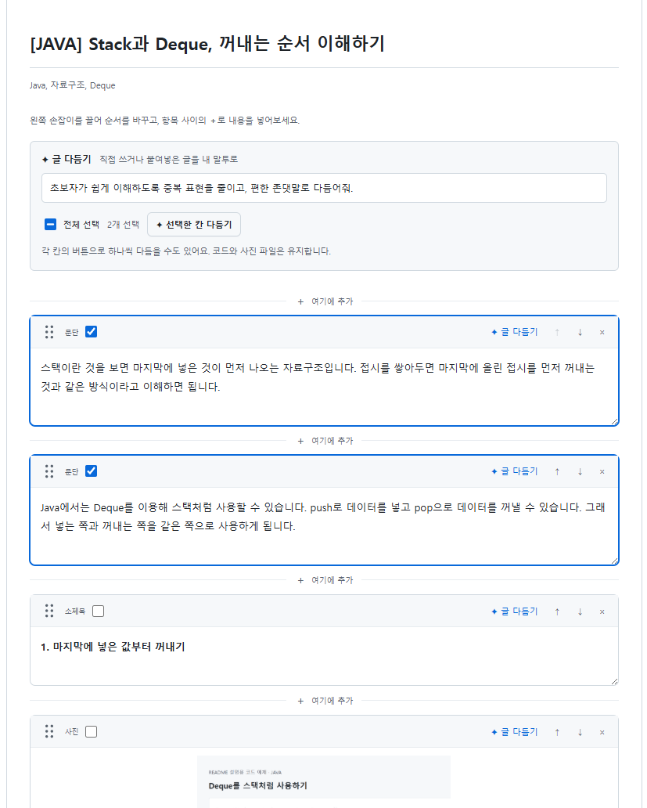
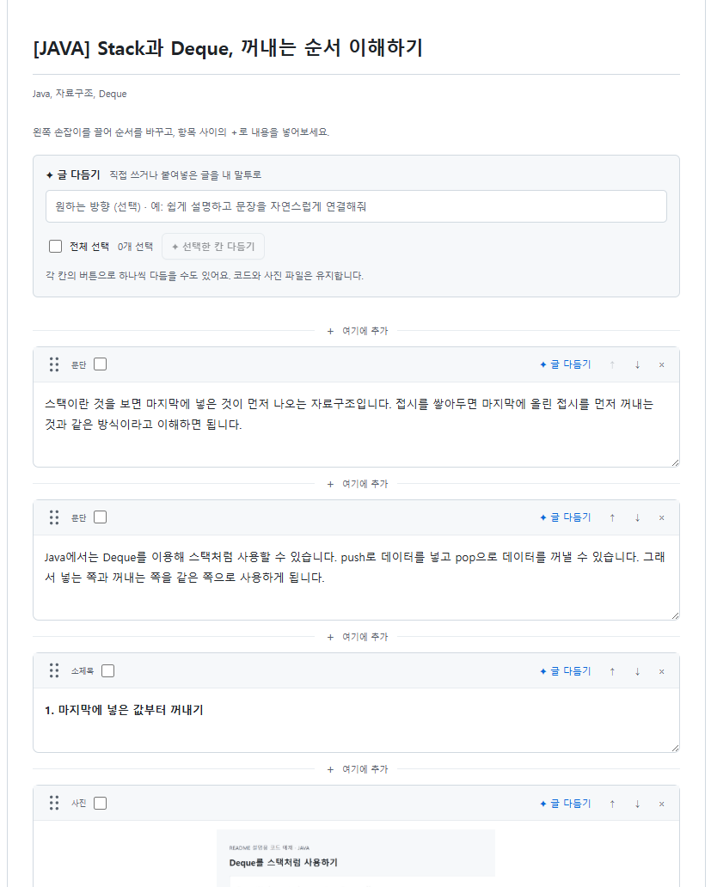
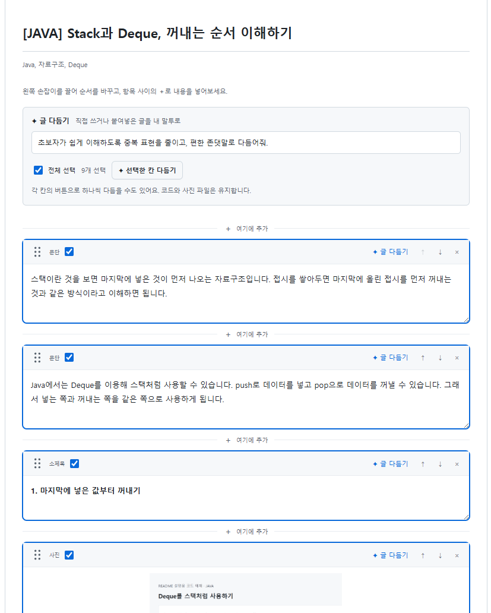
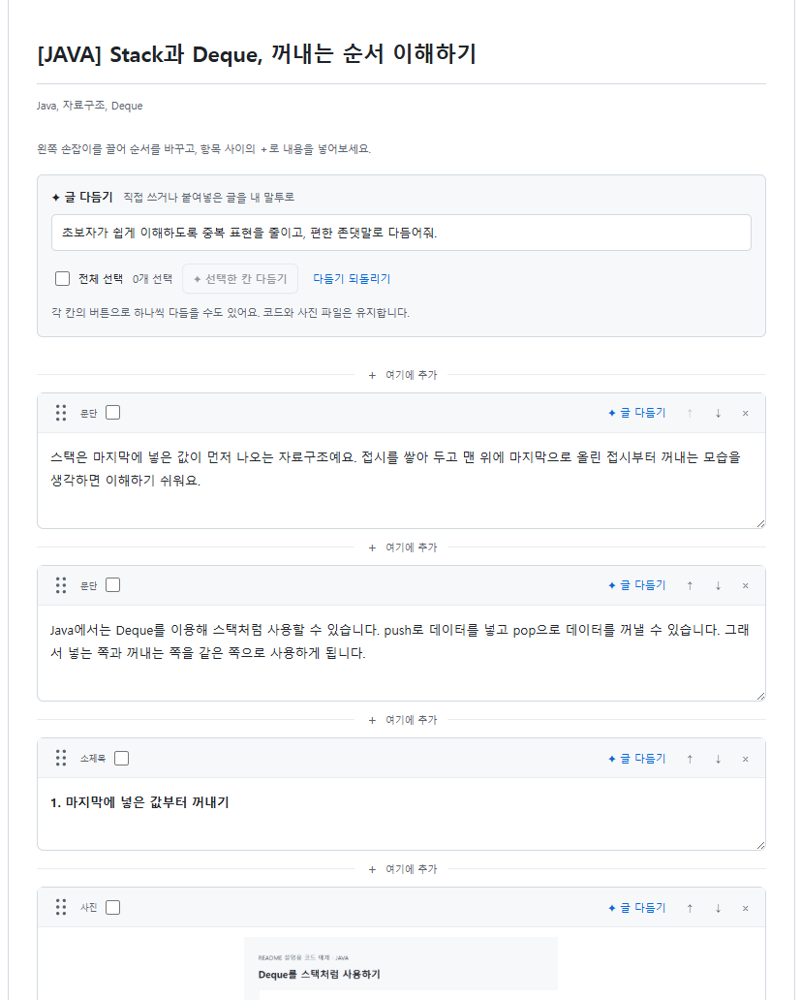
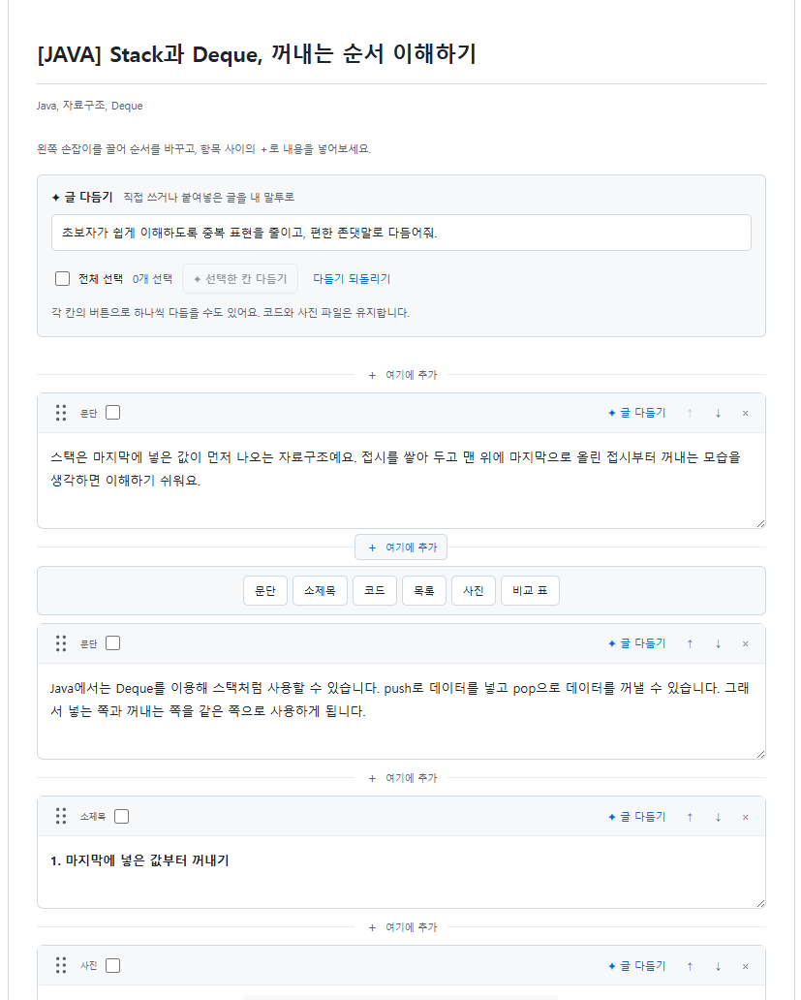
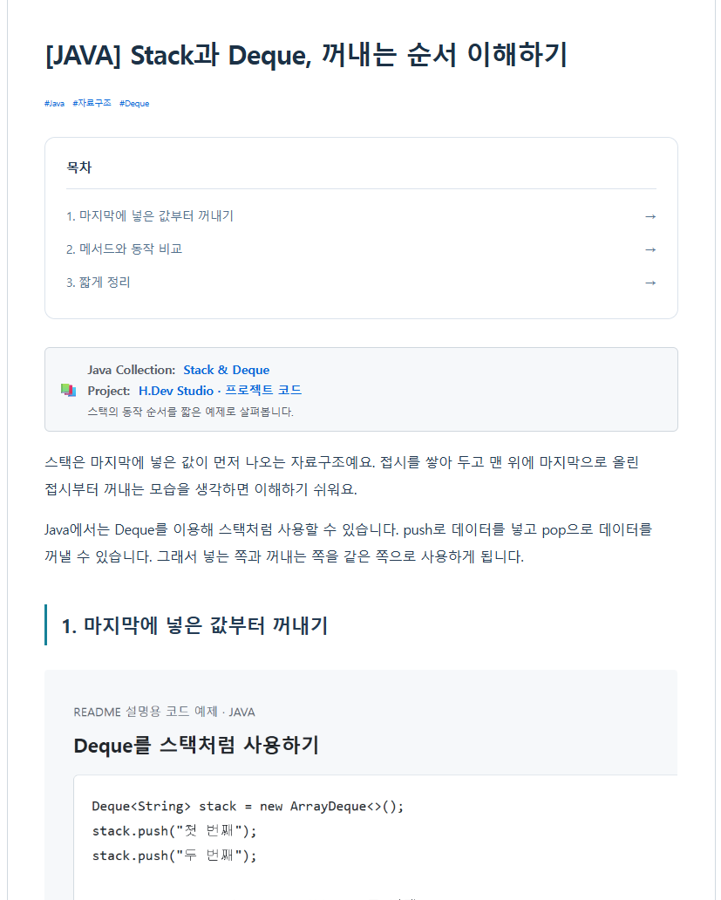
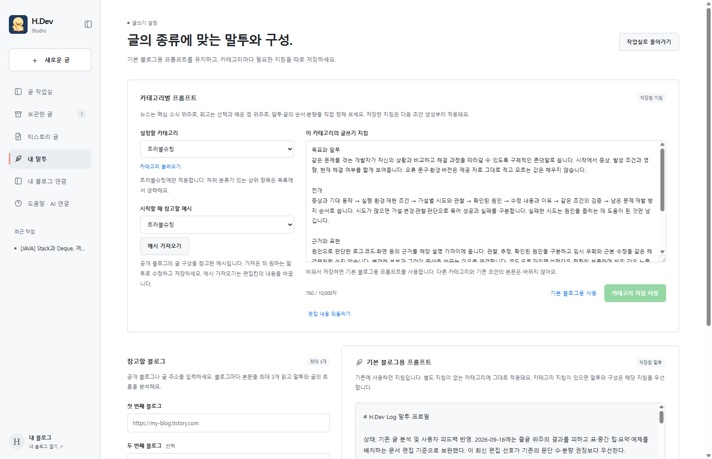
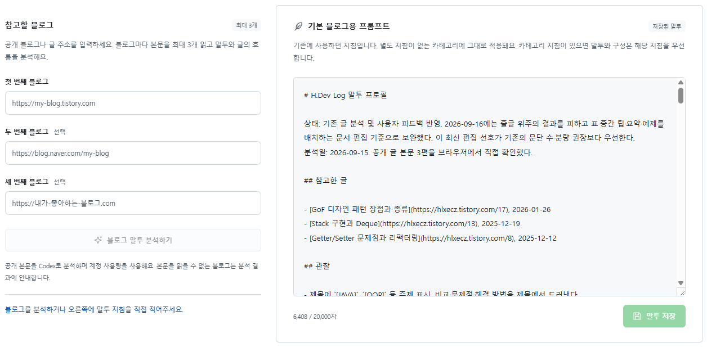

# H.Dev Studio 기능과 실제 화면

[← README로 돌아가기](../README.md) · [설치부터 발행까지 보기](USAGE.md)

이 문서는 H.Dev Studio의 주요 기능을 실제 앱 화면으로 설명합니다. 화면은 2026-09-23에 README 설명용 글·코드 사진·카테고리를 사용해 촬영했으며 실제 블로그에는 발행하지 않았습니다.

## 1. 사진과 메모로 시작하거나, 글을 직접 쓰기

왼쪽은 **글의 재료**, 오른쪽은 **편집·미리보기** 공간입니다.

| 시작 방법 | 사용 순서 |
| --- | --- |
| 캡처로 글 만들기 | 사진 업로드 → 주제·작업 메모 입력 → 카테고리 선택 → **내 말투로 초안 만들기** |
| 기존 글 붙여넣기 | **직접 작성하기** → 문단 칸에 붙여넣기 → 필요한 칸 다듬기 |
| 처음부터 직접 쓰기 | **직접 작성하기** → 소제목·문단·코드 등을 추가하며 작성 |

사진 아래 **참고자료**에 블로그·문서·공개 노션 링크를 최대 5개 넣을 수 있습니다. **자료 읽기**로 내용을 확인한 뒤 초안에 활용합니다. 사진 없이 직접 쓰는 것도 가능합니다.

## 2. 원하는 칸만 AI로 다듬기

**편집**을 누르면 글이 문단·소제목·사진·코드 등의 칸으로 나뉩니다. 직접 내용을 고치거나 선택한 부분만 AI로 다듬을 수 있습니다.

1. 다듬을 칸에 글을 직접 쓰거나 붙여넣습니다.
2. 요청란에 `초보자가 쉽게 이해하도록 중복 표현을 줄이고, 편한 존댓말로 다듬어줘`처럼 방향을 적습니다.
3. 한 칸의 **✦ 글 다듬기**, 체크 후 **선택한 칸 다듬기**, **전체 선택** 중 하나를 사용합니다.

| 범위 | 바뀌는 부분 |
| --- | --- |
| 한 칸 | 누른 칸의 문장만 |
| 여러 칸 | 체크한 칸의 문장만 |
| 전체 | 다듬을 수 있는 모든 칸의 문장 |

한 칸 다듬기·전체 선택 화면 보기

코드와 사진 파일은 유지됩니다. 사진 칸은 기존 설명·대체 텍스트의 문장만 다듬고, 제목·태그·카테고리·표지·GitHub 카드·칸 순서도 유지합니다. 표와 목록의 구조도 바꾸지 않습니다.

다듬기는 **도움말 · AI 연결**에서 선택하고 로그인한 Codex 또는 Claude Code를 사용합니다. 기본 말투와 카테고리 지침도 반영합니다.

## 3. 수정 결과 확인하고 되돌리기

첫 번째 문단만 실제 Codex로 다듬고 나머지 9개 칸이 유지되는 것을 확인했습니다.

| 수정 전 | 수정 후 |
| --- | --- |
| 스택이란 것을 보면 마지막에 넣은 것이 먼저 나오는 자료구조입니다. | 스택은 마지막에 넣은 값이 먼저 나오는 자료구조예요. |

다듬은 결과는 자동 보관됩니다. 마음에 들지 않으면 **다듬기 되돌리기**로 복원할 수 있습니다. 결과를 직접 편집한 뒤에는 그 편집을 덮어쓰지 않도록 되돌리기가 제한됩니다.

## 4. 칸을 끌어 옮기고, 중간에 내용 추가하기

각 칸 왼쪽의 점 여섯 개 손잡이를 잡고 끌어 옮기거나 ↑·↓ 버튼을 사용합니다. 칸 사이의 **＋ 여기에 추가**에서는 문단·소제목·코드·목록·사진·비교 표를 선택할 수 있습니다.

## 5. 목차·GitHub 카드·사진 배치 미리보기

소제목으로 목차를 만들고, **GitHub 카드**에 주제·저장소 링크·설명을 입력하면 목차 아래에 정보 카드가 표시됩니다. **표지 · 대표 이미지**에서 본문 사진을 고르거나 별도 사진을 올릴 수 있습니다.

검토를 마친 뒤 **티스토리에 발행**을 누르면 사진 업로드부터 공개 게시까지 진행합니다. **초안 보관**은 이 PC에 저장하는 기능입니다.

## 6. 카테고리별 말투와 기본 프롬프트

**내 말투**에서 AI 뉴스·인사이트·프로젝트 회고·트러블슈팅·개발 개념·사용법의 지침을 저장할 수 있습니다.

- 별도 지침이 없는 분류에는 기본 블로그용 프롬프트가 적용됩니다.
- 공개 블로그를 최대 3개 넣어 말투를 분석하고 결과를 확인한 뒤 반영합니다.
- 지침을 저장해도 기존 글은 즉시 바뀌지 않고 다음 초안 생성과 글 다듬기부터 적용됩니다.

6,408자 기본 프롬프트와 참고 블로그 설정 화면 보기

자세한 설치·발행 순서는 [사용 안내](USAGE.md), 오류 해결은 [트러블슈팅](TROUBLESHOOTING.md)에서 확인하세요.
